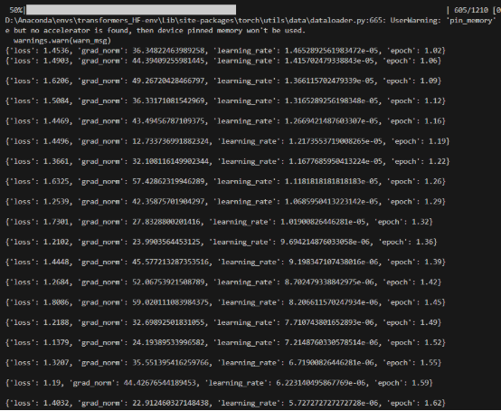

基于Hugging Face Transformers库的Q&A模型的初步の实现

- 准备环境
  - 安装transformers库

    运行：pip install transformers datasets evaluate

    

- 加载数据集
  - 导入Hugging Face的模型库

    

  - 加载SQuAD数据库

    

- 数据预处理
  - 加载DistilBERT tokenizer工具，用于将文本分词（tokenize）并转换为模型可处理的数值形式

- 对数据进行tokenize处理，并返回input\_ids, attention\_mask等数据

  

- 对SQuAD数据进行批处理

  

- 模型训练
  - 加载问答模型

    

  - 设置训练参数

    

  - 训练模型初始化

    

  - 使用默认数据收集器

    

  - 训练开始

- 评估模型
  - 设置评估函数

    

  - 进行模型评估

结果反馈\
在进行了1210个样本的训练后，QA模型结果表现良好

Loss值也在逐渐收敛

