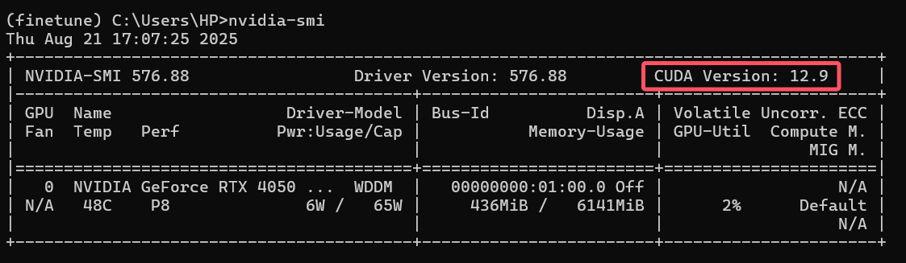

# 基于本地SQuAD格式数据集微调模型流程

## 环境准备

### 创建虚拟环境

搜索并运行 **Anaconda Navigator**


点击侧栏 **Environments**，选择下方的 **Create**，选择默认选项即可


### 配置虚拟环境

#### 安装一般的包

创建完毕后点击右侧播放键，选择 **Open Terminal**


输入以下命令行以安装需要的包
```pip install transformers datasets evaluate```


此过程耗时较长，等待安装完毕如下


补充：此包非必须安装，仅部分模型下载时速度

```
pip install hf_xet
```

此外对于一些模型，可能会依赖某些特定的包，只需根据报错提示安装对应包即可

补充：使用 PyTorch 的 Trainer **必须**安装`accelerate`包

```
pip install 'accelerate>=0.26.0'
```

#### 安装pytorch

这里选取`Windows/Linux，有GPU版`

##### 查看支持的CUDA版本

在命令行输入`nvidia-smi`，关注表中`CUDA Version`处



如果没有值需要自行安装CUDA驱动

##### 安装pytorch

根据`CUDA Version`来到[PyTorch官网](https://pytorch.org/get-started/locally/)，结合自己设备，生成安装命令


以`Stable`、`Windows`、`Pip`、`Python`、`CUDA 12.9`为例，生成的安装命令如下：

```
pip3 install torch torchvision --index-url https://download.pytorch.org/whl/cu129
```

文件较大，耐心等待...


安装完成，可关闭**终端**和 **AnacondaNavigator**


### 选择虚拟环境

在工作目录下打开命令行，并输入以下命令在该目录在激活配置好的虚拟环境

```
conda activate finetune
```

当提示符前括号内显示为虚拟环境名称时，表明激活成功

*重新打开命令行后需要重新激活，或者其他工具或方法实现一劳永逸的绑定*


这里演示一下vscode的方法

使用快捷键`ctrl+shift+P`，输入`Python: Select Interpreter`，选择下方的`在工作区级别选择`

然后虚拟环境中的python解释器


## 微调模型

**强烈建议运行 [finetuneTest.py](./finetuneTest.py) 来完成以下步骤**

~~*当然一步步将脚本内容分步输入python解释器也不是不行*~~

脚本运行时的第一个参数为模型的名称，请**直接粘贴**从huggingface模型库中复制的模型名称

点击此处复制名称


脚本执行时需要传递参数示例如下

```
python finetunetest.py liam168/qa-roberta-base-chinese-extractive ./liam168qa-roberta-base-chinese-extractive
```

其中`liam168/qa-roberta-base-chinese-extractive`是复制的模型名称，`./liam168qa-roberta-base-chinese-extractive`是将训练好的模型保存到该目录

相关代码可能实际使用时需要修改

执行脚本前请确保 **DeepinWiki.json** 在工作目录下，以及已经激活了虚拟环境

运行时间较长耐心等待……


